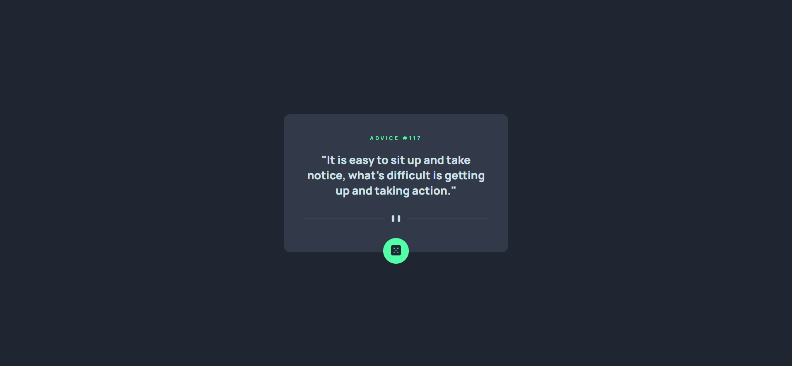
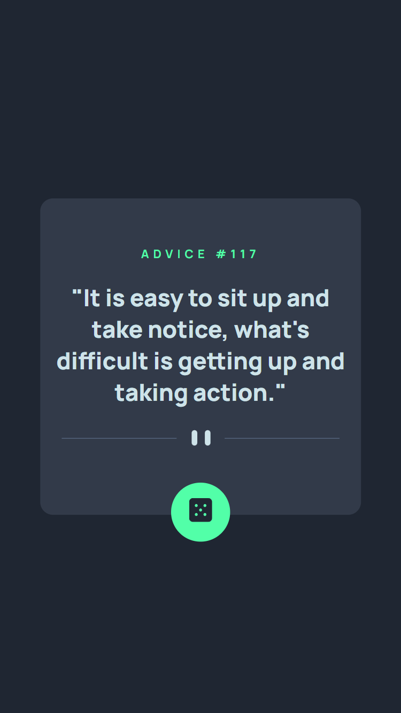

# Frontend Mentor | Advice generator app
O principal desafio é construir um aplicativo que gere conselhos aleatórios. Nessa primeira etapa será realizado apenas a construção do HTML e CSS.

## Índice

- Design
- Links
- Tecnologias utilizadas

## Visão geral

### Design desktop 🖥️

### Design mobile 📱

## Links

- Desafio do Frontend Mentor: [Advice generator app](https://www.frontendmentor.io/challenges/advice-generator-app-QdUG-13db)

## Tecnologias utilizadas

- HTML
- CSS
